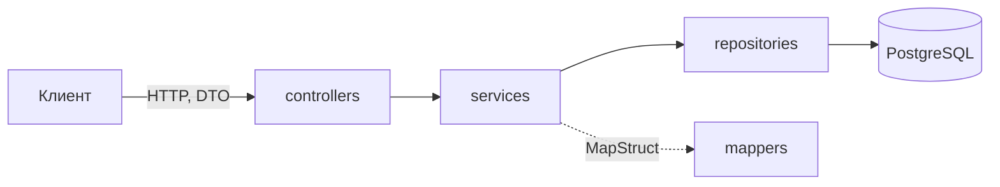

# Shop — интернет-магазин электроники и бытовой техники

[](https://openjdk.org/)
[](https://spring.io/projects/spring-boot)
[](https://www.postgresql.org/)
[](https://www.rabbitmq.com/)
[](https://docs.docker.com/compose/)

Shop — интернет-магазин электроники и бытовой техники. Проект состоит из REST API, веб-клиента и инфраструктуры, которая поднимается через Docker Compose:

*   `backend/` — REST API на Spring Boot.
*   `frontend/` — веб-клиент.
*   `tools/docker/` — сервисы: PostgreSQL, RabbitMQ, S3-хранилище RustFS, Mailpit, pgAdmin.
*   `.env.example` — шаблон настроек для всех сервисов проекта.

---

## Содержание

- [Требования](#требования)
- [Установка](#установка)
- [Запуск](#запуск)
  - [Разработка](#разработка)
  - [Продакшен](#продакшен)
  - [Сервисы и порты](#сервисы-и-порты)
- [Переменные окружения](#переменные-окружения)
- [Архитектура backend](#архитектура-backend)
- [Стек](#стек)

---

## Требования

*   [Docker](https://docs.docker.com/get-docker/) с плагином Docker Compose.

## Установка

1.  Склонировать репозиторий: `git clone https://github.com/Bitsulov/shop-coursework.git`.
2.  Скопировать `.env.example` в `.env` в корне проекта и заполнить значения (см. [Переменные окружения](#переменные-окружения)). В качестве хостов указываются имена контейнеров.

## Запуск

Все команды выполняются из `tools/docker`.

### Разработка

```powershell
docker compose --env-file ..\..\.env up -d
```

Кроме основных сервисов запускаются pgAdmin и Mailpit, а порты сервисов открываются наружу.

### Продакшен

```powershell
docker compose --env-file ..\..\.env -f compose.yaml -f compose.prod.yaml up -d
```

Наружу порты не открываются. Контейнеры автоматически перезапускаются после сбоя.

### Сервисы и порты

Порты, открытые в режиме разработки:

| Сервис     | Порт            | Назначение                    |
| ---------- | --------------- | ----------------------------- |
| API        | `8080`          | REST API                      |
| PostgreSQL | `5432`          | База данных                   |
| RabbitMQ   | `5672`, `15672` | Брокер сообщений, веб-консоль |
| RustFS     | `9000`, `9001`  | S3 API, веб-консоль           |
| pgAdmin    | `5050`          | Администрирование БД          |
| Mailpit    | `1025`, `8025`  | SMTP-заглушка, просмотр писем |

## Переменные окружения

| Переменная                                 | Описание                                                |
|--------------------------------------------|---------------------------------------------------------|
| **База данных**                            |                                                         |
| `DB_HOST`, `DB_PORT`                       | Хост и порт PostgreSQL                                  |
| `DB_NAME`                                  | Имя базы данных                                         |
| `DB_USERNAME`, `DB_PASSWORD`               | Учётные данные PostgreSQL                               |
| **S3-хранилище**                           |                                                         |
| `S3_ENDPOINT`                              | Адрес, по которому API обращается к хранилищу           |
| `S3_PUBLIC_URL`                            | Базовый адрес ссылок на файлы, которые получают клиенты |
| `S3_USERNAME`, `S3_PASSWORD`               | Ключи доступа RustFS                                    |
| `S3_BUCKETNAME`                            | Имя бакета                                              |
| **RabbitMQ**                               |                                                         |
| `RABBIT_MQ_HOST`                           | Хост брокера                                            |
| `RABBIT_MQ_USERNAME`, `RABBIT_MQ_PASSWORD` | Учётные данные брокера                                  |
| `RABBIT_MQ_VHOST`                          | Виртуальный хост                                        |
| **Почта**                                  |                                                         |
| `MAIL_HOST`, `MAIL_PORT`                   | SMTP-сервер (в разработке — Mailpit)                    |
| `MAIL_USERNAME`, `MAIL_PASSWORD`           | Учётные данные SMTP                                     |
| `MAIL_SMTP_AUTH`                           | Включить аутентификацию SMTP                            |
| `MAIL_SMTP_STARTTLS`                       | Включить STARTTLS                                       |
| **Безопасность**                           |                                                         |
| `CORS_ALLOWED_ORIGINS`                     | Разрешённые источники через запятую                     |
| `JWT_SECRET_KEY`                           | Секрет подписи токенов, не короче 32 байт               |
| `JWT_ACCESS_TIME`                          | Время жизни access-токена, мс                           |
| `JWT_REFRESH_TIME`                         | Время жизни refresh-токена, мс                          |
| **Логи**                                   |                                                         |
| `LOG_LEVEL_APP`                            | Уровень логов приложения                                |
| `LOG_LEVEL_SQL_BIND`                       | Уровень логов параметров SQL-запросов.                  |
| **Документация API**                       |                                                         |
| `SWAGGER_ENABLED`                          | Включить Swagger UI по адресу `/swagger-ui.html`        |
| **pgAdmin**                                |                                                         |
| `PGADMIN_EMAIL`, `PGADMIN_PASSWORD`        | Учётные данные входа в pgAdmin                          |

## Архитектура backend



Каждый слой обращается только к следующему. Сущности не выходят за пределы сервисного слоя, наружу отдаются DTO.

*   **Схема БД:** таблицы создаются и изменяются только миграциями Flyway (`src/main/resources/db/migration`). При запуске Hibernate проверяет, что сущности совпадают с таблицами.
*   **Ошибки:** сервисы выбрасывают доменные исключения, а `GlobalExceptionHandler` превращает их в ответ единого формата `AppError`. В нём есть HTTP-статус `statusCode`, текст ошибки `message`, путь запроса `path` и время `timestamp`.

## Стек

**Backend**

*   Java 25, Spring Boot 4.1.1, Gradle
*   PostgreSQL 18, Spring Data JPA / Hibernate, Flyway
*   Spring Security, JWT (jjwt)
*   RabbitMQ (Spring AMQP), Spring Mail
*   S3-хранилище RustFS, клиент MinIO, Thumbnailator
*   MapStruct, Lombok
*   OpenAPI (Swagger)
*   JUnit 5, Mockito, Testcontainers

**Frontend** — в разработке.

**Инфраструктура** — Docker Compose.
