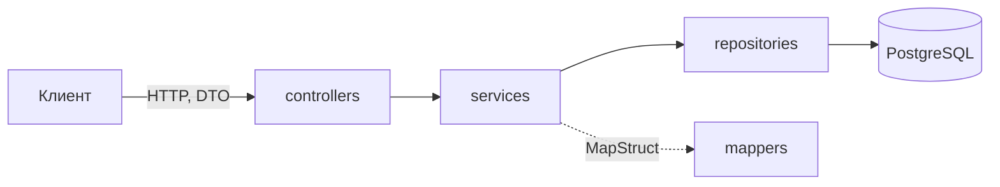
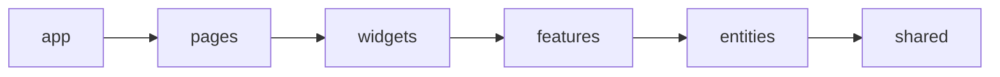

# Shop — интернет-магазин электроники и бытовой техники

[](https://openjdk.org/)
[](https://spring.io/projects/spring-boot)
[](https://www.postgresql.org/)
[](https://www.rabbitmq.com/)<br>
[![TypeScript](https://img.shields.io/badge/TypeScript-6-3178c6?logo=data%3Aimage%2Fsvg%2Bxml%3Bbase64%2CPHN2ZyB4bWxucz0iaHR0cDovL3d3dy53My5vcmcvMjAwMC9zdmciIHZpZXdCb3g9IjAgMCAyNCAyNCI%2BPHJlY3QgeD0iMSIgeT0iMSIgd2lkdGg9IjIyIiBoZWlnaHQ9IjIyIiBmaWxsPSIjZmZmIi8%2BPHBhdGggZmlsbD0iIzMxNzhDNiIgZD0iTTEuMTI1IDBDLjUwMiAwIDAgLjUwMiAwIDEuMTI1djIxLjc1QzAgMjMuNDk4LjUwMiAyNCAxLjEyNSAyNGgyMS43NWMuNjIzIDAgMS4xMjUtLjUwMiAxLjEyNS0xLjEyNVYxLjEyNUMyNCAuNTAyIDIzLjQ5OCAwIDIyLjg3NSAwem0xNy4zNjMgOS43NWMuNjEyIDAgMS4xNTQuMDM3IDEuNjI3LjExMWE2LjM4IDYuMzggMCAwIDEgMS4zMDYuMzR2Mi40NThhMy45NSAzLjk1IDAgMCAwLS42NDMtLjM2MSA1LjA5MyA1LjA5MyAwIDAgMC0uNzE3LS4yNiA1LjQ1MyA1LjQ1MyAwIDAgMC0xLjQyNi0uMmMtLjMgMC0uNTczLjAyOC0uODE5LjA4NmEyLjEgMi4xIDAgMCAwLS42MjMuMjQyYy0uMTcuMTA0LS4zLjIyOS0uMzkzLjM3NGEuODg4Ljg4OCAwIDAgMC0uMTQuNDljMCAuMTk2LjA1My4zNzMuMTU2LjUyOS4xMDQuMTU2LjI1Mi4zMDQuNDQzLjQ0NHMuNDIzLjI3Ni42OTYuNDFjLjI3My4xMzUuNTgyLjI3NC45MjYuNDE2LjQ3LjE5Ny44OTIuNDA3IDEuMjY2LjYyOC4zNzQuMjIyLjY5NS40NzMuOTYzLjc1My4yNjguMjc5LjQ3Mi41OTguNjE0Ljk1Ny4xNDIuMzU5LjIxNC43NzYuMjE0IDEuMjUzIDAgLjY1Ny0uMTI1IDEuMjEtLjM3MyAxLjY1NmEzLjAzMyAzLjAzMyAwIDAgMS0xLjAxMiAxLjA4NSA0LjM4IDQuMzggMCAwIDEtMS40ODcuNTk2Yy0uNTY2LjEyLTEuMTYzLjE4LTEuNzkuMThhOS45MTYgOS45MTYgMCAwIDEtMS44NC0uMTY0IDUuNTQ0IDUuNTQ0IDAgMCAxLTEuNTEyLS40OTN2LTIuNjNhNS4wMzMgNS4wMzMgMCAwIDAgMy4yMzcgMS4yYy4zMzMgMCAuNjI0LS4wMy44NzItLjA5LjI0OS0uMDYuNDU2LS4xNDQuNjIzLS4yNS4xNjYtLjEwOC4yOS0uMjM0LjM3My0uMzhhMS4wMjMgMS4wMjMgMCAwIDAtLjA3NC0xLjA4OSAyLjEyIDIuMTIgMCAwIDAtLjUzNy0uNSA1LjU5NyA1LjU5NyAwIDAgMC0uODA3LS40NDQgMjcuNzIgMjcuNzIgMCAwIDAtMS4wMDctLjQzNmMtLjkxOC0uMzgzLTEuNjAyLS44NTItMi4wNTMtMS40MDUtLjQ1LS41NTMtLjY3Ni0xLjIyMi0uNjc2LTIuMDA1IDAtLjYxNC4xMjMtMS4xNDEuMzY5LTEuNTgyLjI0Ni0uNDQxLjU4LS44MDQgMS4wMDQtMS4wODlhNC40OTQgNC40OTQgMCAwIDEgMS40Ny0uNjI5IDcuNTM2IDcuNTM2IDAgMCAxIDEuNzctLjIwMXptLTE1LjExMy4xODhoOS41NjN2Mi4xNjZIOS41MDZ2OS42NDZINi43ODl2LTkuNjQ2SDMuMzc1eiIvPjwvc3ZnPg%3D%3D)](https://www.typescriptlang.org/)
[](https://react.dev/)
[![React Router](https://img.shields.io/badge/React%20Router-8-ca4245?logo=data%3Aimage%2Fsvg%2Bxml%3Bbase64%2CPHN2ZyB3aWR0aD0iNjAyIiBoZWlnaHQ9IjM2MCIgdmlld0JveD0iMCAwIDYwMiAzNjAiIGZpbGw9Im5vbmUiIHhtbG5zPSJodHRwOi8vd3d3LnczLm9yZy8yMDAwL3N2ZyI%2BCjxwYXRoIGQ9Ik00ODEuMzYgMTgwQzQ4MS4zNiAxOTYuNTcyIDQ3NC42MzggMjExLjU3MiA0NjMuNzU3IDIyMi40MkM0NTIuODc1IDIzMy4yOCA0MzcuODQ1IDI0MCA0MjEuMjQgMjQwQzQwNC42MzUgMjQwIDM4OS42MDUgMjQ2LjcwOCAzNzguNzM1IDI1Ny41NjhDMzY3Ljg1MyAyNjguNDI4IDM2MS4xMiAyODMuNDI4IDM2MS4xMiAzMDBDMzYxLjEyIDMxNi41NzIgMzU0LjM5OCAzMzEuNTcyIDM0My41MTcgMzQyLjQyQzMzMi42MzUgMzUzLjI4IDMxNy42MDUgMzYwIDMwMSAzNjBDMjg0LjM5NSAzNjAgMjY5LjM2NSAzNTMuMjggMjU4LjQ5NSAzNDIuNDJDMjQ3LjYxMyAzMzEuNTcyIDI0MC44OCAzMTYuNTcyIDI0MC44OCAzMDBDMjQwLjg4IDI4My40MjggMjQ3LjYxMyAyNjguNDI4IDI1OC40OTUgMjU3LjU2OEMyNjkuMzY1IDI0Ni43MDggMjg0LjM5NSAyNDAgMzAxIDI0MEMzMTcuNjA1IDI0MCAzMzIuNjM1IDIzMy4yOCAzNDMuNTE3IDIyMi40MkMzNTQuMzk4IDIxMS41NzIgMzYxLjEyIDE5Ni41NzIgMzYxLjEyIDE4MEMzNjEuMTIgMTQ2Ljg1NiAzMzQuMjEgMTIwIDMwMSAxMjBDMjg0LjM5NSAxMjAgMjY5LjM2NSAxMTMuMjggMjU4LjQ5NSAxMDIuNDJDMjQ3LjYxMyA5MS41NzIgMjQwLjg4IDc2LjU3MiAyNDAuODggNjBDMjQwLjg4IDQzLjQyOCAyNDcuNjEzIDI4LjQyOCAyNTguNDk1IDE3LjU2OEMyNjkuMzY1IDYuNzA4IDI4NC4zOTUgMCAzMDEgMEMzMzQuMjEgMCAzNjEuMTIgMjYuODU2IDM2MS4xMiA2MEMzNjEuMTIgNzYuNTcyIDM2Ny44NTMgOTEuNTcyIDM3OC43MzUgMTAyLjQyQzM4OS42MDUgMTEzLjI4IDQwNC42MzUgMTIwIDQyMS4yNCAxMjBDNDU0LjQ1IDEyMCA0ODEuMzYgMTQ2Ljg1NiA0ODEuMzYgMTgwWiIgZmlsbD0iI0Y0NDI1MCIvPgo8cGF0aCBkPSJNMjQwLjg4IDE4MEMyNDAuODggMTQ2Ljg2MiAyMTMuOTYzIDEyMCAxODAuNzYgMTIwQzE0Ny41NTcgMTIwIDEyMC42NCAxNDYuODYyIDEyMC42NCAxODBDMTIwLjY0IDIxMy4xMzcgMTQ3LjU1NyAyNDAgMTgwLjc2IDI0MEMyMTMuOTYzIDI0MCAyNDAuODggMjEzLjEzNyAyNDAuODggMTgwWiIgZmlsbD0id2hpdGUiLz4KPHBhdGggZD0iTTEyMC42NCAzMDBDMTIwLjY0IDI2Ni44NjMgOTMuNzIzMyAyNDAgNjAuNTE5OSAyNDBDMjcuMzE2NSAyNDAgMC4zOTk5MDIgMjY2Ljg2MyAwLjM5OTkwMiAzMDBDMC4zOTk5MDIgMzMzLjEzOCAyNy4zMTY1IDM2MCA2MC41MTk5IDM2MEM5My43MjMzIDM2MCAxMjAuNjQgMzMzLjEzOCAxMjAuNjQgMzAwWiIgZmlsbD0id2hpdGUiLz4KPHBhdGggZD0iTTYwMS42IDMwMEM2MDEuNiAyNjYuODYzIDU3NC42ODMgMjQwIDU0MS40OCAyNDBDNTA4LjI3NyAyNDAgNDgxLjM2IDI2Ni44NjMgNDgxLjM2IDMwMEM0ODEuMzYgMzMzLjEzOCA1MDguMjc3IDM2MCA1NDEuNDggMzYwQzU3NC42ODMgMzYwIDYwMS42IDMzMy4xMzggNjAxLjYgMzAwWiIgZmlsbD0id2hpdGUiLz4KPC9zdmc%2BCg%3D%3D)](https://reactrouter.com/)
[](https://redux-toolkit.js.org/)<br>
[](https://docs.docker.com/compose/)

Shop — интернет-магазин электроники и бытовой техники. Проект состоит из REST API, веб-клиента и инфраструктуры, которая поднимается через Docker Compose:

*   `backend/` — REST API на Spring Boot.
*   `frontend/` — веб-клиент на React Router.
*   `tools/docker/` — сервисы: Nginx, PostgreSQL, RabbitMQ, S3-хранилище RustFS, Mailpit, pgAdmin.
*   `.env.example` — шаблон настроек для всех сервисов проекта.

---

## Содержание

- [Требования](#требования)
- [Установка](#установка)
- [Запуск](#запуск)
  - [Разработка](#разработка)
  - [Продакшен](#продакшен)
  - [Сервисы и порты](#сервисы-и-порты)
- [Переменные окружения](#переменные-окружения)
- [Архитектура backend](#архитектура-backend)
- [Архитектура frontend](#архитектура-frontend)
- [Стек](#стек)

---

## Требования

*   [Docker](https://docs.docker.com/get-docker/) с плагином Docker Compose.

## Установка

1.  Склонировать репозиторий: `git clone https://github.com/Bitsulov/shop-coursework.git`.
2.  Скопировать `.env.example` в `.env` в корне проекта и заполнить значения (см. [Переменные окружения](#переменные-окружения)). В качестве хостов указываются имена контейнеров.

## Запуск

Все команды выполняются из `tools/docker`.

### Разработка

```powershell
docker compose --env-file ..\..\.env up -d
```

Кроме основных сервисов запускаются pgAdmin и Mailpit, а порты сервисов открываются наружу.

### Продакшен

```powershell
docker compose --env-file ..\..\.env -f compose.yaml -f compose.prod.yaml up -d
```

Наружу открыт только порт `80` Nginx, через который проходят все запросы. Nginx передаёт запросы по адресу `/api/` в API и открывает хранилище RustFS по адресу `/storage/` только для чтения. Остальные запросы обрабатывает веб-клиент. Контейнеры автоматически перезапускаются после сбоя.

### Сервисы и порты

Порты, открытые в режиме разработки:

| Сервис     | Порт            | Назначение                    |
| ---------- | --------------- | ----------------------------- |
| Nginx      | `80`            | Точка входа для всех запросов |
| Frontend   | `3000`          | Веб-клиент                    |
| API        | `8080`          | REST API                      |
| PostgreSQL | `5432`          | База данных                   |
| RabbitMQ   | `5672`, `15672` | Брокер сообщений, веб-консоль |
| RustFS     | `9000`, `9001`  | S3 API, веб-консоль           |
| pgAdmin    | `5050`          | Администрирование БД          |
| Mailpit    | `1025`, `8025`  | SMTP-заглушка, просмотр писем |

## Переменные окружения

| Переменная                                 | Описание                                                |
|--------------------------------------------|---------------------------------------------------------|
| **База данных**                            |                                                         |
| `DB_HOST`, `DB_PORT`                       | Хост и порт PostgreSQL                                  |
| `DB_NAME`                                  | Имя базы данных                                         |
| `DB_USERNAME`, `DB_PASSWORD`               | Учётные данные PostgreSQL                               |
| **S3-хранилище**                           |                                                         |
| `S3_ENDPOINT`                              | Адрес, по которому API обращается к хранилищу           |
| `S3_PUBLIC_URL`                            | Базовый адрес ссылок на файлы, которые получают клиенты |
| `S3_USERNAME`, `S3_PASSWORD`               | Ключи доступа RustFS                                    |
| `S3_BUCKETNAME`                            | Имя бакета                                              |
| **RabbitMQ**                               |                                                         |
| `RABBIT_MQ_HOST`                           | Хост брокера                                            |
| `RABBIT_MQ_USERNAME`, `RABBIT_MQ_PASSWORD` | Учётные данные брокера                                  |
| `RABBIT_MQ_VHOST`                          | Виртуальный хост                                        |
| **Почта**                                  |                                                         |
| `MAIL_HOST`, `MAIL_PORT`                   | SMTP-сервер (в разработке — Mailpit)                    |
| `MAIL_USERNAME`, `MAIL_PASSWORD`           | Учётные данные SMTP                                     |
| `MAIL_SMTP_AUTH`                           | Включить аутентификацию SMTP                            |
| `MAIL_SMTP_STARTTLS`                       | Включить STARTTLS                                       |
| **Безопасность**                           |                                                         |
| `CORS_ALLOWED_ORIGINS`                     | Разрешённые источники через запятую                     |
| `JWT_SECRET_KEY`                           | Секрет подписи токенов, не короче 32 байт               |
| `JWT_ACCESS_TIME`                          | Время жизни access-токена, мс                           |
| `JWT_REFRESH_TIME`                         | Время жизни refresh-токена, мс                          |
| **Логи**                                   |                                                         |
| `LOG_LEVEL_APP`                            | Уровень логов приложения                                |
| `LOG_LEVEL_SQL_BIND`                       | Уровень логов параметров SQL-запросов.                  |
| **Документация API**                       |                                                         |
| `SWAGGER_ENABLED`                          | Включить Swagger UI по адресу `/swagger-ui.html`        |
| **pgAdmin**                                |                                                         |
| `PGADMIN_EMAIL`, `PGADMIN_PASSWORD`        | Учётные данные входа в pgAdmin                          |

## Архитектура backend



Каждый слой обращается только к следующему. Сущности не выходят за пределы сервисного слоя, наружу отдаются DTO.

*   **Схема БД:** таблицы создаются и изменяются только миграциями Flyway (`src/main/resources/db/migration`). При запуске Hibernate проверяет, что сущности совпадают с таблицами.
*   **Ошибки:** сервисы выбрасывают доменные исключения, а `GlobalExceptionHandler` превращает их в ответ единого формата `AppError`. В нём есть HTTP-статус `statusCode`, текст ошибки `message`, путь запроса `path` и время `timestamp`.

## Архитектура frontend

Код веб-клиента разделён на слои по методологии [Feature-Sliced Design](https://feature-sliced.design/ru/).



Каждый слой импортирует только слои ниже себя. Модуль внутри слоя открывает наружу только то, что экспортирует его `index.ts`.

*   **Маршруты:** всё, что связано с React Router, находится в слое `app`. Файлы маршрутов только подключают страницы из `pages`.
*   **Состояние:** данные с сервера хранит TanStack Query, а Redux хранит глобальное состояние на клиенте.

## Стек

**Backend**

*   Java 25, Spring Boot 4.1.1, Gradle
*   PostgreSQL 18, Spring Data JPA / Hibernate, Flyway
*   Spring Security, JWT (jjwt)
*   RabbitMQ (Spring AMQP), Spring Mail
*   S3-хранилище RustFS, клиент MinIO, Thumbnailator
*   MapStruct, Lombok
*   OpenAPI (Swagger)
*   JUnit 5, Mockito, Testcontainers

**Frontend**

*   TypeScript, React 19, Vite
*   React Router 8,
*   Redux Toolkit, TanStack Query, axios
*   React Hook Form, Zod
*   SCSS Modules
*   Vitest, Testing Library, MSW
*   ESLint, Stylelint, Prettier

**Инфраструктура** — Docker Compose.
